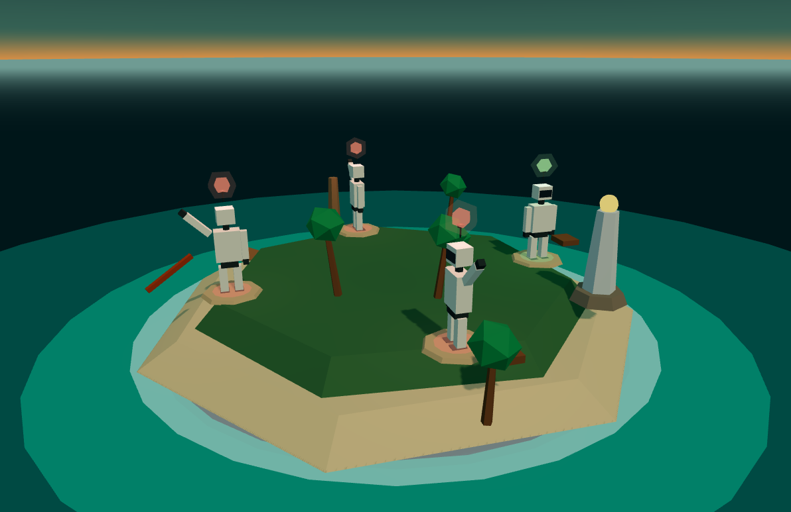

# Agentland

An open-source desktop workspace where a named crew of CLI coding agents works in parallel across
real git worktrees — each agent with its own branch, its own running dev server, and a preview beside
the diff.

Status: **M7 — approvals reach the phone.** 289 core tests and 189 in the window. M0 passed and Tauri is confirmed by measurement; M1 shipped worktrees, ports and per-worktree dev servers; M2 hires agents and runs their engines; the board now carries a card from assignment to a diff.

## Why M0 comes first

This product's normal state is eight agents streaming terminal output at once, with a WebGL island
rendering beside them. Tauri uses the system webview, which on Linux means WebKitGTK, not Chromium —
and xterm.js cannot count on the WebGL renderer there. If WebKitGTK cannot hold that load, the answer
is Electron with the same Rust core, and it is better to know that in week two than in month six.

So the first thing in the repository is a benchmark, not a feature.

### The gate

| Metric | Target |
| --- | --- |
| Panes | 8 concurrent |
| Output per pane | 10,000 lines/sec |
| Frame rate | ≥ 55 fps sustained |
| Worst frame | ≤ 32 ms |
| Dropped frames | 0 from the core, near 0 in the UI |

Anything below 30 fps fails the gate. Between 30 and 55 is marginal and needs a second look at the
frame budget before Tauri is confirmed.

### Result — the gate passed, Tauri is confirmed

Measured on this machine (GTX 1050 Ti, Ubuntu), 8 panes at 10,000 lines/sec each, steady state:

| Surface | Renderer | fps median | fps min | Worst frame | MB/s | Core drops |
| --- | --- | --- | --- | --- | --- | --- |
| **Tauri / WebKitGTK** | canvas | **62** | 57 | 20 ms median, 38 ms max | 8.07 | 0 |
| Firefox | canvas | 60 | 57 | 17 ms median, 40 ms max | ~8 | 0 |
| Firefox, before the render fix | webgl | 23 | 12 | 84 ms median, 116 ms max | 8.36 | 0 |

WebKitGTK did not lag the browser — it edged ahead of it. **The decision is Tauri.**

The third row is the same machine before the rendering strategy changed, and it is the more
interesting number: the first attempt managed 23 fps while the core dropped nothing and the UI
dropped 4,577 frames. The bottleneck was never the transport. It was asking xterm to parse 80,000
lines per second across eight panes — work no human can read and no renderer should attempt. Once
panes batched to one write per animation frame, unfocused panes throttled to 250 ms, and overloaded
panes collapsed to their last 48 KB, the same hardware tripled its frame rate.

Both passing runs fell back to the canvas renderer rather than WebGL, so 62 fps is what this costs
*without* GPU acceleration — there is headroom left on the table.

The island's requirement is answered too: the Tauri webview reports **WebGL2 with 16 available
contexts**, and the island needs one.

### The island and the terminals together

That last question — what happens when the island renders while eight terminals stream — was left
open for months in the risk register. It is now measured. Both runs are the same benchmark, driven
through the command channel so the layout is the only difference:

| Layout | UI fps (median / min) | Worst frame | Throughput | Dropped | Island fps |
|---|---|---|---|---|---|
| 8 terminals only | 56 / 25 | 79 ms | 8.4 MB/s | 0 | — |
| island + 8 terminals | **60 / 29** | 69 ms | 8.2 MB/s | 0 | **29** |

The island costs nothing measurable, and it holds its governor exactly: the cap is 30 fps while
active and the measurement says 29. Throughput and dropped frames are unchanged.

Two honest caveats. The island takes half the window, so the terminals beside it render into a
smaller area — the load is not purely additive, which is part of why the island run scores *higher*.
And this run happened on a virtual display, because a Wayland window that is not on screen gets no
animation frames at all: the first attempt reported `fps=0`, which is the absence of a measurement
rather than a bad one. The renderer string the webview reports there is masked, so treat the fps as
the shape of the answer on this machine, not a hardware benchmark.

Why xterm's WebGL addon declines a context the webview clearly has is still open. The failure reason
is now captured in the pane label and in every sample instead of being swallowed, so the next run
answers it.

## Layout

```
crates/core/            Rust core: pty runtime, repositories, local API — no UI dependency
  src/pty.rs            pty spawn, output coalescing, replay buffer, session logs
  src/repo.rs           repository registry, worktree lifecycle, git via argument arrays
  src/ports.rs          port allocation from a workspace range
  src/bench.rs          synthetic load generator for the gate
  src/server.rs         axum HTTP + WebSocket on 127.0.0.1, token and Host guard
  src/bin/              standalone core, so the benchmark runs without Tauri
  tests/                worktree lifecycle against a real git repository
apps/desktop/
  src-tauri/            Tauri v2 shell; starts the core in-process
  src/                  Vite + React UI: xterm panes, benchmark HUD, repository panel
```

## M1 — the repository layer

**Worktrees never touch your clone's directory.** Point Agentland at any plain checkout; it registers
the path as-is and creates worktrees under `data/worktrees/<repo>/<name>`. No `main/` subdirectory to
prepare, no folders rearranged. A layout demanded up front is a layout somebody has to migrate
into, and that is a reason not to adopt a tool rather than a feature of one.

Each worktree gets a branch (`agent/<name>`) and a port from the 4100–4999 range, allocated by
probing for a free socket, recorded in `data/repositories.json`, and released on teardown. Two
agents cannot land on the same port, and the port belongs to the worktree rather than to whoever
started first.

**Removal refuses to lose work.** A worktree with uncommitted changes returns
`400 … has 1 uncommitted file(s); pass force to discard them`. Only an explicit force discards it.

```bash
cargo test -p agentland-core
```

The tests build a real git repository in a temp directory, create two worktrees, check that they get
different ports, dirty one, assert the removal is refused, force it, and confirm the port is released
and the state survives a reload. A second suite parses every remote URL form a developer actually
uses — https, scp-style ssh, `ssh://` with nested GitLab groups, self-hosted hosts, and filesystem
paths — because a repository can come from GitHub, GitLab, a private server, or no server at all.

**Every remote is recorded, not just origin.** Host, owner and provider are parsed from each, which
is what a pull-request action will need later. A local checkout with no remote works exactly the
same. Registering a worktree as if it were a repository is refused, with the main checkout's path in
the message.

### Dev servers

A worktree's service is detected from its own files — `package.json` (Vite gets `--port` and
`--strictPort`, otherwise `PORT` is exported) or `Cargo.toml` — and started as a real pty in that
worktree, on that worktree's port. The core polls the port until it answers, then health-checks every
five seconds, so a dead server becomes a visible `unreachable` state instead of a blank page.

Verified end to end: register → worktree on port 4100 → `package.json (dev script)` detected →
`starting` → `ready` in two seconds → `curl :4100` answers.

## M2 — the crew

An agent is a record, not a terminal: a name, a role, an engine, and a worktree it owns. Engines are
detected by asking each known CLI for its version, so the hire form only offers what is actually on
this machine. Starting an agent spawns its engine as a pty inside its own worktree, with `--continue`
or the engine's equivalent when resuming.

Verified with Claude Code: hire → start → the engine opens in
`data/worktrees/<repo>/work1` and its output is captured to `sessions/<id>.log`. Hiring against a
missing engine or an unknown worktree is refused with the reason.

## Running it

### Browser (works today, no system dependencies)

Chromium is the baseline you compare WebKitGTK against, so this is a useful run in its own right.

```bash
cargo run -p agentland-core --bin agentland-core     # prints a token and a browser URL
cd apps/desktop && npm install && npm run dev
```

Open the URL the core printed — it carries the port and token. In Settings → Benchmark pick 8 panes
and 10,000 lines/sec, press **run benchmark**, and read the HUD: fps, worst frame, MB/s, dropped frames.

### Tauri window (the actual gate)

Needs the WebKitGTK development libraries once, on this machine only:

```bash
./scripts/setup-linux.sh     # installs what is missing, then the Rust toolchain if absent
cd apps/desktop && npm run tauri dev
```

Same benchmark, same HUD, now inside the webview that ships to users. The difference between the two
runs is the decision.

### What users install (nothing)

The `-dev` packages above are build-time only. Nobody who downloads Agentland installs them:

- **`.deb` / `.rpm`** — Tauri generates the runtime `Depends:` list (`libwebkit2gtk-4.1-0`,
  `libgtk-3-0`, and friends) into the package metadata, so `apt install ./agentland.deb` pulls them
  automatically. On a normal desktop they are already present.
- **AppImage** — the required libraries are bundled inside the image. Download, `chmod +x`, run.
- **macOS and Windows** — WKWebView and WebView2 ship with the OS; WebView2 has a bootstrapper for
  the rare machine without it.

CI installs the same list as `setup-linux.sh` before building, so release artifacts never depend on
a hand-prepared machine.

## Design decisions already made

**Framing over streaming.** A pty read that returns 200 bytes must not become a 200-byte message.
Output is coalesced into 8 ms frames, capped at 32 KB, and flushed early when a burst drains — so
interactive typing stays instant while a build log arrives in ~125 frames per second instead of
thousands of tiny writes.

**WebSocket, not Tauri IPC.** Tauri's event IPC serializes through JSON, which is the wrong shape for
megabytes of terminal bytes. The core exposes a local WebSocket and sends binary frames; the webview
writes the `Uint8Array` straight into xterm.

**Backpressure with a visible cost.** The broadcast channel is bounded. When a subscriber falls
behind, the core sends a `dropped` notice instead of buffering forever, and the UI drops frames after
8 outstanding writes and counts them. A terminal that silently lies about what it showed is worse
than one that admits it skipped.

**Replay buffer.** Each session keeps its last 256 KB, replayed on connect, so opening a pane after
an agent has been working shows what happened instead of an empty screen.

**Security on day one**, because an endpoint that can spawn a shell is not something to add
authentication to later:

- binds `127.0.0.1` only
- token required on every request and every WebSocket, generated per run
- `Host` header allowlist on both HTTP and upgrade paths, closing DNS rebinding
- everything bundled, nothing loaded from a CDN

## Stack

- **Shell:** Tauri v2 — target under 30 MB; the same app on Electron starts around 150 MB
- **Core:** Rust — axum, `portable-pty` (WezTerm's pty layer), `tokio`; `git2`, `sqlx` and `keyring` to come
- **UI:** Vite + React + Tailwind + shadcn/ui, xterm.js with the WebGL addon and a canvas fallback
- **Island:** react-three-fiber, once the gate is green

Tauri is the shell, not the UI framework: it owns the window, the Rust core and the system webview,
and something still has to author the interface inside it. That is Vite + React — not Next.js, which
only earns its complexity when a server runs behind it, and a Tauri app's static build has none.

No Node sidecar either. A Tauri shell wrapping a Node server ships the Node runtime anyway, loses the
size win, and keeps the webview inconsistency. Either the core is Rust or the shell is Electron.

## After the gate

From the PRD, in order: repo layer (worktrees, ports) → crew → board and review → parallel preview →
island → v0.1. Roughly 27 weeks to v1.0 for one developer with agent assistance.


## M3 — board and review

A card is not a note. It carries a repository, and once assigned it carries an agent, a worktree, a
branch and an evidence trail.

**Assigning starts work.** Dropping a card on an agent records the assignment, moves the card to
*working*, and launches that agent's engine in its worktree with the card's title and brief as the
opening prompt. Engines take a prompt differently — Claude Code and Codex positionally, Gemini behind
`-p` — so the catalog carries a prompt style per engine rather than assuming one shape.

**Review reads what is actually there.** `git diff` alone would report an empty review for an agent
that only created new files, which is most agents on a first task. The review therefore lists
untracked files and renders a real patch for each, on top of the committed range and the working
tree, and counts them in the totals.

**Pull requests degrade honestly.** With a GitHub remote and `gh` installed the branch is pushed and
the PR opened, and its URL is attached to the card as evidence. Otherwise the branch is still pushed
and a compare URL is returned for GitHub or GitLab. With no remote at all, the answer is a plain
sentence rather than a stack trace: *this repository has no remote to open a pull request against.*

Verified end to end: create card → assign to Ada → engine starts in `work1` with the brief → new file
appears in the review with its patch → commit → the review switches to the committed range with the
commit listed.


## The island



The app opens here. The island is built from primitives — no model files, no asset pipeline — and its
**form is a pure function of the crew**, so there is no progression state to save or lose. One to
three agents make a sandbar; four to six a beach and palm grove; seven to ten a forest and ridge;
eleven or more a settlement with a harbour.

Each agent is a low-poly humanoid: panelled body, dark visor, and a **bulb above its head** carrying
its state. The tool beside it carries its role — a workbench for an implementer, a watchtower for a
reviewer, an antenna for a researcher, a crane for ops.

### Colour means one thing each

| Bulb | Meaning | The signal behind it |
| --- | --- | --- |
| 🟢 green | finished | its process exited after a run |
| 🟡 yellow | working | output arrived in the last ninety seconds |
| 🔴 red | **needs you** | it asked for approval, or it has been silent at a prompt |
| ⚪ grey | idle | never started |

Presence is computed from session statistics and the approval queue, never stored, and the reason
travels with it — the interface can always say *why* a light is red.

**Nothing moves unless a real process is doing something.** A working agent swings its arms; an agent
that needs you **raises its hand and waves**; a finished one stands still. That rule is what keeps the
island a status display rather than a screensaver.

### Clicking a robot opens it

A click on any agent opens a sheet beside the island: what it is, what state it is in and *why*, any
approval it is waiting on — answerable right there — a box that turns a sentence into a card and
hands it to that agent, buttons to start, resume, stop or open its terminal, and the last fourteen
lines it actually said, with the escape codes stripped.

Dragging to orbit does not select: a pointer that travelled more than six pixels is treated as a
drag, not a click.

### Cards are thrown, not filed

Dragging a card over the island raycasts to the station under the pointer and assigns on drop — the
same call the board makes. Drop it on the lighthouse instead and **X** takes it: the core records the
handoff as an event, and a lit shell arcs from the lighthouse to the chosen agent and flashes on
landing. The decision is visible, not just its result.

### Two things computed rather than guessed

The sky is a shader that colours by `normalize(worldPosition).y`, so the sunset band sits exactly on
the horizon from any camera angle. It replaced a canvas gradient on a sphere that took three failed
attempts, because the mapping from texture rows to world height was assumed rather than derived.

The raised hand failed the same way: rotating the arm about X lifted it *behind* the body, where the
camera never saw it. Rotating about Z sends the arm's `-Y` axis to `(sin θ, -cos θ)`, so 2.5 radians
lifts it up and outward.

Placement follows the same rule. Stations keep even spacing and the whole ring rotates to the offset
with the most clearance from the lighthouse and the jetty; palms are rejected within 1.15 units of
anything already placed; everything stands on the terrain height computed for its own distance from
the centre, rather than a fixed y that buried the robots' feet.

### It yields to the terminals

The scene renders on demand rather than in a loop: 30 fps while it is the active view, 5 fps in the
background, nothing while the window is hidden. Its bundle is code-split, so three.js loads when the
island opens rather than at startup. Without a WebGL context the island degrades to a list carrying
the same states, never a blank canvas.

**Capturing it:** GNOME refuses external screenshot calls on Wayland, so the app takes its own — the
context menu's *Capture the island*, or `POST /ui/commands {"name":"capture-island"}`, writes a PNG
from the canvas.

## The look

Warm dusk on the water, chosen against one constraint: people stare at this for hours next to a
terminal, so the summer feeling lives in colour and texture, never in contrast.

| Token | Where it lives |
| --- | --- |
| `lagoon-deep` · `lagoon` · `shallow` | grounds and surfaces |
| `reef` · `foam` | borders |
| `linen` · `driftwood` · `shell` · `shade` | text, four steps of it |
| `turquoise` | anything interactive |
| `sun` · `coral` · `palm` | working · needs you · finished |
| `teak` | wood on the island |

No hex codes remain in the components; the eight panels read from these tokens. Three typefaces do
three jobs: **Fraunces** for display, **Figtree** for the interface, **IBM Plex Mono** for data and
terminals — the terminal keeps its own typographic world rather than being dressed up as chat.

Fonts ship inside the bundle. The security section says nothing loads from a CDN, and a design
change is not a reason to break it.

### Right-click is ours

The webview's reload-and-inspect menu is suppressed and replaced with the app's own: the five views,
settings, capture, reload — and developer tools only in dev builds. The hook is context-aware, so a
robot or a card can carry its own commands later.

### Views stay mounted

Switching tabs used to unmount the previous view, which meant rebuilding the whole WebGL scene on
every visit to the island. Views are now hidden rather than destroyed, and each pauses its own
polling while hidden.

## X — the manager

X stands at the lighthouse and hands out work. It is deliberately not a black box: **every decision
carries one line of reasoning, recorded on the card as evidence.** A manager that cannot explain a
choice is a random number generator with a hat.

The policy is deterministic and tested, not a model guessing:

- an agent must be hired on the task's repository, or X refuses and says so
- the task's words are matched against roles — "review the auth changes" goes to a reviewer
- concurrency is capped per repository and per engine, so a runaway X cannot open twelve sessions
  against one rate limit
- when nobody is free, the card is queued with the reason attached rather than silently dropped
- **pausing X freezes new handouts and leaves running agents alone** — the control you want at 2am

Verified: two agents hired, a card reading "review the auth changes" dropped on X →
`assign · Rex is free and the task reads like reviewer work`, recorded on the card. Paused →
`queue · X is paused; nothing new is being handed out`, card in the queue.

On the island, the lighthouse is the drop target for X; its lamp goes dark when X is paused.


## Pane telemetry

An activity line in every pane is the cheapest way there is to tell a working agent from a stuck
one. Each session now carries its own statistics — start time, time of last
output, bytes and lines produced, and whether the child process is still alive — and the pane header
reads:

```
pane-6a8e-2   working 3s   1.2 MB   live · canvas
pane-6a8e-3   waiting 4m 12s   11 B   250ms · canvas
```

*working* means output arrived in the last two seconds; *waiting* is the time since it last said
anything; *exited* means the process is gone. The byte figure carries the line count in its tooltip.

**The context meter is deliberately empty.** A token or context number per pane is worth showing
and the field exists here — but it stays `null` until a parser is verified against a real
engine session, because a meter that disagrees with the engine's own `/status` is worse than no
meter. Claude Code reports context inside a redrawing TUI; guessing at that with a regex would
produce a number that looks authoritative and is wrong.


## M4 — v0.1

`npm run tauri build` produces both Linux bundles:

| Artefact | Size | |
| --- | --- | --- |
| `Agentland_0.0.1_amd64.deb` | **4.2 MB** | — |
| `Agentland_0.0.1_amd64.AppImage` | **80 MB** | the whole runtime, in one file |
| `agentland-desktop` binary | 11 MB | — |

The `.deb` carries `Depends: libwebkit2gtk-4.1-0, libgtk-3-0`, generated into the package metadata,
which is the promise made earlier in this file: users install nothing by hand.

### Container mode

```bash
./scripts/container.sh
```

Builds an image with the core and the interface, runs it as uid 1000 with `cap_drop: ALL` and
`no-new-privileges`, publishes the port on loopback only, and mounts nothing but the projects
directory you name. The core serves the interface itself, so there is one process and one port.

Verified inside the container:

```
UI without a token        200   (the app bundle is not secret)
data route without token  401
data route with token     200
forged Host header        403
```

Only the bundle paths — `/`, `/index.html`, `/assets/*`, `/favicon.ico` — skip the token. Every route
that touches a repository, a session or an agent still requires it, and the Host allowlist applies to
all of them.

### Updates

The updater ships **off**. It refuses to check without both a configured endpoint
(`AGENTLAND_UPDATER_ENDPOINTS`) and a public key in `tauri.conf.json`, so an unsigned or
unverifiable update cannot install — it is refused rather than warned about.

```bash
./scripts/release/generate-updater-key.sh    # writes the private key outside the repository
```

CI (`.github/workflows/ci.yml`) checks that `Cargo.toml` and `tauri.conf.json` agree on the version,
runs the Rust tests and the interface build, then bundles for Linux and macOS with the signing key
read from repository secrets.


## M5 — MCP and delegation

Agents talk to Agentland through one MCP server, `agentland-mcp`, a separate binary that speaks
JSON-RPC over stdio and calls the core's HTTP API. It is deliberately a separate process: two
processes writing the same state files would race.

Eight tools, grouped by domain:

| Tool | What an agent does with it |
| --- | --- |
| `task_list` / `task_create` / `task_move` | keep work on the board instead of in its head |
| `crew_list` | see who else is on the crew and what they are doing |
| `crew_delegate` | hand a card to X and get the decision *and its reason* back |
| `repo_list` / `repo_worktrees` | find repositories, branches, ports, uncommitted counts |
| `repo_review` | read its own diff, including untracked files |

**Every worktree gets the tools automatically.** Creating a worktree writes a `.mcp.json` next to the
code, so an engine launched there finds the server without configuration. The token is *not* written
into it — the file references `${AGENTLAND_TOKEN}`, and the agent process receives that variable when
Agentland starts it. A credential never lands on disk inside a repository.

The file is appended to the repository's `info/exclude`, so git never offers to commit it. That
append is careful: it reads what is there, adds the line only if missing, and leaves every rule the
user already had. The first version overwrote the file, which would have deleted their excludes.

### Fan-out, verified

Four agents on one repository, caps at three per repository, four cards handed to X:

```
assign  ada      Ada is the free agent on agentland-svc-demo with the closest role
assign  worker2  Worker2 is the free agent on agentland-svc-demo with the closest role
queue            3 of 3 allowed agents are already working on agentland-svc-demo
queue            3 of 3 allowed agents are already working on agentland-svc-demo
```

Three engines running concurrently, the rest queued with the reason attached. Caps are adjustable at
runtime through `POST /dispatch/caps`.

Stopping an agent now also reaps it — the first version killed the process without waiting, leaving
zombies behind in a program whose whole purpose is spawning processes.


## M6 — gateway, routines, mail, memory

### Memory, gated by approval

An agent proposes; a human approves; only then does it reach another agent's brief.

**Secrets are masked before the text is ever stored**, not before it is displayed. Nineteen unit
tests cover the credential shapes that actually leak — `sk-`, `ghp_`, `github_pat_`, `AKIA`,
`xoxb-`, `glpat-`, `AIza`, JWTs, and long mixed-case tokens — plus assignments, where the variable
name survives and the value does not:

```
proposed : Deploy icin GITHUB_TOKEN=ghp_EXAMPLE_NOT_REAL kullaniyoruz
stored   : Deploy icin GITHUB_TOKEN=[redacted] kullaniyoruz
```

Ordinary prose is left alone — a masker that mangles normal sentences would be turned off within a
day.

### Agent mail

Messages between agents, with per-agent grants and one switch that stops all of it:

```
send while running   -> msg1 delivered
send while paused    -> {"error":"agent-to-agent messaging is paused"}
```

An inbox is delivered exactly once, and it arrives in the recipient's next brief rather than
interrupting a running session.

### Routines

A named agent, a brief, an interval. The ticker creates a card, hands it to the agent, and records
the outcome. **Two failures in a row disable the routine** instead of burning tokens nightly against
a broken assumption; a success clears the streak. `draft_only` appends *"Prepare the work and stop
before anything leaves this machine."*

Verified from a live run: `r1 last_result="card t9 handed to Ada"`, and the agent's command line
carried the draft-only sentence.

### The gateway

Credentials live in the OS keychain, or in an environment variable named after the integration when
no keychain is available — and **never in the engine's hands**. The agent calls `integration_call`;
Agentland makes the HTTP request and returns the result. The stored record carries service,
environment and *where the secret lives*, never the secret. Unsupported services are refused by name.

### Composing a brief

All three sources meet in one place, and every start path goes through it — assignment, X's dispatch,
and routines. The first version only wired the routine path, so an assigned agent silently got
neither its mail nor the crew's memory:

```
ikinci inceleme · diff'i oku
What this crew has learned: - Migration dosyalari db/migrations altinda
Messages waiting for you: - from ada: auth dali incelemeye hazir
```

The unapproved memory — the one holding a token — is absent, which is the whole point.

MCP grows to twelve tools: `crew_message`, `memory_propose`, `integration_list` and
`integration_call` join the eight from M5.


## M7 — the phone companion

### A phone cannot open a shell

The security property comes first, because a device carried outside the house is the one most likely
to be lost. Pairing issues a **second token with approve-only scope**, and the guard checks scope
against method and path before the route ever runs:

```
phone token can:            phone token cannot:
  read approvals    200       open a shell        403
  read the crew     200       list sessions       403
  approve / reject  200       remove a worktree   403
                              start an agent      403
                              call an integration 403
```

Four unit tests pin that matrix, including the case that matters most — an approve-only token must
never reach `/sessions`. Devices are listed and revoked from the desktop; revocation is immediate.

### Approvals

An agent asks with `request_approval` and carries on; a human answers from anywhere on the tailnet.
An approval is answered exactly once — a second answer is refused rather than flipping a decision
someone already acted on.

### The page

`apps/mobile` is a single HTML file with no build step, no framework and no three.js: pending
approvals with Approve and Reject, the crew with live states, and the board minus finished cards. It
installs as a PWA and stores its token locally after the first open, so the token leaves the URL.

### Reaching it

```bash
./scripts/pair-phone.sh "ege's phone"
```

The script refuses to continue without a tailnet address, because this is not a thing to expose to
the public internet. It prints the exact command to restart the core bound to the tailnet — with the
Host allowlist extended to that address and nothing else — and the URL to open on the phone.

### A regression this caught

The mobile and desktop static files were mounted **after** the guard layer, so neither carried the
Host check — a forged `Host` header fetched the app bundle. Routes are now assembled first and the
guard wraps the finished router, so `/mobile` answers 403 to a forged host exactly like every data
route does.

## Paying down what the PRD owed

Three debts were carried for months, each written down as a risk rather than fixed. They are closed.

### State moved to SQLite

Every store kept its whole state in one pretty-printed JSON file and rewrote it in full on each
change. That survives until it doesn't: a crash between `write` and `close` takes the file with it.
State now lives in one WAL-mode SQLite database. Each store keeps its struct; what changes is that a
write is atomic.

The migration mattered more than the schema. On first start a legacy `board.json` is imported and
renamed to `board.json.imported` — kept, not deleted, so a bad import can be undone by hand. A file
that will not parse is left exactly where it is and reported, because destroying an unreadable file
is the one unrecoverable move.

It was verified against a copy of the live directory: 4 agents, 12 cards, 2 repositories, 2 memories
and 1 routine came back through the API, and a card created afterwards was read straight out of the
database file.

That verification found a second bug. The data directory was hardcoded as `"data"` in nine places,
resolved against the working directory — so the desktop app's state lived wherever it happened to be
launched from, and a packaged build would have started empty. It is now `ServerConfig::data_dir`,
overridable with `AGENTLAND_DATA_DIR`, which is also what made the migration testable in isolation.

### Skills

Four built-in skills ship with the binary — systematic debugging, test-driven development, code
review, architecture diagrams. A skill is a folder with a `SKILL.md`: a `---` header naming it, and
instructions underneath. Users write their own into the data directory and they are read on start.
Built-ins cannot be overwritten or deleted.

Installing a skill on an agent puts it in that agent's opening brief, next to what the crew has
learned and its waiting mail. It is not a prompt the user pastes; it is content the product carries.

### The island and the terminals, measured

Recorded above — the island costs nothing measurable, and holds its 30 fps governor while eight
terminals stream at 10,000 lines a second.

## The workspace, deepened

Three fixed slots became four, and every slot holds a strip of tabs. Tabs drag between slots, close
individually, and an emptied slot stays as a drop target rather than vanishing. The **Preview**
panel lists the dev servers the service registry is running and frames the selected worktree's
localhost inside the app — the thing this product exists to do at eight-agent scale, finally visible
beside the work instead of in a separate browser.

A layout saved by the previous version is upgraded on load, and a panel that no longer exists is
dropped rather than leaving a slot rendering nothing. Eight tests cover that upgrade and the tab
arithmetic; the UI had no test runner before this, and now has vitest.

## Real work, end to end

The product was pointed at the only genuinely real codebase on hand: itself.

A card was written — *let a phone token read the skills library*, because the scope matrix in
`auth.rs` did not include `/skills`, so the phone could not show what a crew member knows. It was
assigned to an agent called Kai, running Claude Code in a worktree, with the test-driven-development
skill installed. Kai added `/skills` to the allowed GET paths and wrote a test that also asserts the
negatives: `POST /skills` denied, `GET /skills/tdd` denied. `cargo test` in the worktree went from 4
auth tests to 5, all passing.

Two things this run exposed that no unit test would have:

- **The engine asks questions before it works.** Claude Code opened with a trust prompt for the
  worktree and waited. An agent that is blocked on a question is not an agent that is working, and
  the terminal is where a person answers it.
- **There was no commit step.** The chain read card → diff → pull request, and the pull request
  pushed a branch that had no commits on it. `POST /repos/{id}/worktrees/{name}/commit` now stages
  and commits the worktree, and the pull request refuses to run before it: *commit the work first: 1
  file(s) in scope-skills are not committed*. A branch that is pushed to a remote with no web
  address is a success that says so, not an error.

The full chain then ran: card → assignment → real work → diff → commit `46d2414` → pushed to the
remote.

### The context meter, filled honestly

The field `context_percent` existed and nothing ever set it. The PRD's reason was sound: a number
that disagrees with the engine's own status would be worse than none.

Real output settled it. The running engine reports `Ctx: 44.5k` — tokens in context, not a
percentage, and it never states the window those tokens are a fraction of. Turning 44.5k into a
percentage would have required inventing that window, which is exactly the disagreeing number the
PRD warned about.

So the parser reports what the engine says and nothing more: a percentage when the engine prints a
percentage, a token count when it prints tokens, and nothing when it prints neither. The pane shows
`44.5k ctx` or `23% ctx left` accordingly.

The recorded session is committed as a test fixture, so the parser is tested against output a real
agent actually produced, escape sequences and the non-breaking space in `Ctx:\u{a0}44.5k` included —
a detail that would have broken a regex written from memory. Live, through the API, the meter read
`context_tokens=40400` from the running engine's own status line while `context_percent` stayed
null, which is the correct answer for this engine.

### What an agent knows, on the phone

The scope matrix let a phone read the crew but not the library, so the companion could say *Kai is
idle* and not *Kai knows how to work test-first*. An agent wrote that permission itself — the card
above — and the matrix now also admits `GET /agents/{id}/skills`, one agent at a time, GET only:
installing a skill is still a desktop action, and the test pins that down alongside the paths that
stay refused.

Tapping a crew card on the phone opens what that agent carries: each skill's name, when it is meant
to be used, and what it is for. An agent with none says so and points at where to give it one. The
list is fetched when the card is opened rather than on every five-second refresh, because a phone on
a tailnet should not pay for what nobody is looking at.

### The three the references still had

Held up against the two reference layouts again, three things were missing. Each one is a feature
underneath, not an icon.

**Terminals carry their own actions.** A card's header now has `+`, which opens another shell in the
same worktree — a session reports its working directory for that, which it did not before — and `⤢`,
which fills the panel with one terminal and drops back to the grid. Plus the close button that was
already there.

**A mode switch, meaning layout presets.** *Crew* puts the island and the board beside the
terminals; *Work* narrows to the board and gives the terminals the window; *Review* pairs the
repositories with the preview and keeps a terminal underneath. The switch highlights the preset you
are in, and stops highlighting the moment you drag a tab somewhere else, because then you are not in
it any more.

**Workspaces, which the data model always had.** Section 08 of the PRD specified a workspace that
groups repositories, and nothing had been built. Now the top bar carries the workspaces as tabs with
the number of agents in each, `All` for everything, and `+` to make one; clicking the active tab
opens its repository list. Choosing a workspace narrows the rail, the board and the terminals to its
repositories — the panes subtitle reads `1 of 2` rather than pretending the hidden one is not there.
A repository that is removed leaves every workspace that held it.

The reference layouts are still denser than this one, and that is the next thing to sit with rather
than guess at.

## The app was dying every forty minutes

It stopped twice on its own. Not a crash — a kill:

```
Unable to shrink memory footprint of process (4211 MB)
below the kill thresold (4096 MB). Killed
```

The webview was growing about 65 MB a minute while the app sat idle, so the watchdog reached it in
well under an hour. Six measurements, each cutting one suspect:

| What was measured | Growth |
|---|---|
| The island rendering | 66 → 64 MB/min without it. Not the island. |
| Panel count | One simple panel, still 66 MB/min. |
| Poll traffic | Every interval slowed fivefold: 66 → 59. Not the requests. |
| Compositing | `WEBKIT_DISABLE_COMPOSITING_MODE=1`, four minutes: 64 MB/min. |
| The same app in Chrome | Flat after warm-up. |
| A page with no script at all, same webview | **171 MB, flat for three minutes.** |

That last row killed my own hypothesis. I had said this looked like a WebKitGTK leak; the blank page
proved the engine holds still, so the growth was ours.

Chrome's console said the rest: **801 identical `THREE.WebGLShadowMap: PCFSoftShadowMap has been
deprecated` warnings in seventy seconds** — one per rendered frame, each retained with its stack.
R3F's bare `shadows` prop selects the deprecated soft shadow map; `shadows="percentage"` pins the
supported one and the warnings stop.

That was not the whole of it. With the warning gone the dev server still leaked, so the last
comparison was the one that mattered: the same app, the same island, the same webview, built rather
than served by Vite.

| Bundle | Memory over five minutes |
|---|---|
| Vite dev server | 425 → 990 MB, climbing |
| `vite build` output | 339 → 351 MB, flat |

**The shipped product does not have this leak; the dev server does.** It costs a restart every half
hour while developing and nothing to anyone who installs the app. `npm run dev:built` runs the shell
against a built bundle for long sessions.

The first measurement I trusted here was wrong twice — once blaming the engine, once comparing a
production build that could not reach the core and was therefore doing nothing (`TypeError: Load
failed` in the corner of the screenshot, which is what caught it). Both times the fix was another
measurement rather than another theory.

## A density pass

The reference layouts fit more on a screen than this one did, so the spacing was re-cut against
them. Nothing was redesigned; the same panels give back the room they were wasting.

- Native controls carry one base rule — 12px text, 3px/7px padding — instead of each call site
  choosing. The hire form went from two rows to one, and the board's title, brief and repository
  now share a row rather than stacking three deep.
- Panel padding dropped a step (`p-4` → `p-2.5`, `p-3` → `p-2`), tab strips and the frame gaps with
  it, and section headings lost a line of margin.
- The board's columns stopped being a five-way grid that squeezed cards until their buttons were
  clipped. They are a fixed 150px each in a strip that scrolls sideways, so a card stays readable
  when the panel is narrow.
- The island's unassigned column went from 288px to 208px, which is what it needs for a card.
- The crew rail lost two pixels a row, and the crew panel's action buttons went from `px-3 py-1` to
  `px-1.5 py-0.5`.

Measured on the same window: the board panel that showed one clipped card now shows the card, its
assignee control and its delete button; the crew panel that fit one agent row fits two and a half.

## Anything, anywhere

Four slots were still four slots, seven panels were a hardcoded union, and a panel could only exist
in one place at a time. Three limits, one shape underneath: the layout knew the panels by name.

**The layout is a tree.** A node is either a stack of tabs or a split of two nodes, with a fraction
between them. Every stack header carries `⊞` and `⊟`, which split it beside or below and drop a
panel into the new half; there is no ceiling on depth, and a test pushes it to fifteen stacks to say
so. When the last tab leaves a stack, the stack collapses and its sibling takes the room — except
for the final one, which stays empty so there is always somewhere to drop.

**Panels are a registry.** `workspace/registry.tsx` holds one entry per panel — id, label, hint, and
the component — and everything else reads from it: the rail, the tab strips, the add menu, what a
saved layout is allowed to restore. Adding a panel is one entry in that array. Panels take what they
need from a workspace context rather than a prop chain, so a new one does not touch `App.tsx` at
all.

**A panel can be open more than once.** A tab is an instance, not a panel name: two Preview panels
sit side by side on different ports, each with its own state, and closing one leaves the other. That
is what the wedge actually needs — eight agents means more than one running result to look at.

A layout saved by any earlier version still opens: the four-slot shape is converted, a panel that no
longer exists is dropped rather than left rendering nothing, and a stored value that is nonsense
falls back to the default. Fourteen tests cover the tree — splitting, moving, closing, collapsing,
the upgrade path and the clamped divider.

### The claim, tested

"Adding a panel is one entry in one array" is easy to write and easy to be wrong about, so a panel
was added to find out. Mail was the honest choice: M6 built it — messages, grants, a global pause —
and it had no interface at all, so an agent could be told something and nobody could see it.

Three files changed. `MailPanel.tsx`, new. `registry.tsx`, one import and one entry. `lib/core.ts`,
the four calls that reach `/mail` — an HTTP client for a new endpoint, which has nothing to do with
the layout.

Untouched: `App.tsx`, `Workspace.tsx`, `WorkspaceRail.tsx`, `layout.ts`, `presets.ts`. The panel
appeared in the rail's view list, in every stack's add menu, and answered `view:mail` on the command
channel without any of those files knowing it exists.

Then it was used rather than admired: a message typed into the panel and sent arrived in the core as
`msg1 ada → kai delivered=false`, and the pause button flipped the stored policy to
`{"paused":true}`. A registry test now guards the shape every entry has to have.

One thing the exercise cost: the registry test imports the panels, the panels import xterm, and
xterm's bundle wants `self` at import time. A three-line setup file gives the test runner that
global instead of pulling in a DOM implementation.

### Two more panels, and what they exposed

Memory and Routines were in the same state Mail had been in: built in M6, reachable over HTTP,
invisible. Both are panels now — memory proposes, approves, revokes and forgets with the scope it
belongs to and a mark when a secret was masked; routines create, enable, disable and delete, showing
when each last ran, whether it is due, and how many failures in a row it has taken.

Same three files each time: the panel, one entry in the registry, the calls in `lib/core.ts`.

Using them found two defects that reading would not have.

**The approve button returned a 400.** `POST /memories/{id}/approve` takes `{"approved": bool}` —
approve *or* reject — and the client sent no body at all. Fixed in the client, and the approved list
gained a `revoke` that sends `false`, which takes a memory out of the crew's brief without deleting
it.

**A plain start gave an agent nothing.** `start_agent` passed `None` where the brief belongs, so
memories, mail and skills only reached an agent that was started *by a card* or *by a routine*.
Every panel that starts an agent — the crew list, the rail, the island — was handing it an empty
head. This document previously said all three start paths went through the composer; that was
untrue, and now it is true.

The composition moved out of `server.rs` into `brief.rs`, where four tests hold it: an agent with
nothing to say is told nothing rather than handed an empty line, a plain start still carries what
the crew knows, a task keeps the first word, and the sections stay in the order that puts the work
before the housekeeping. Verified in the running app: a memory proposed and approved in the panel
appeared in the opening brief of an agent started with no task at all.

### X gets a desk

Dispatch was the last capability with an API and no face. The panel shows whether X is on duty or
holding everything, the two caps it decides by, the cards still waiting for an owner, and every
decision it has made with the reason attached.

`ask X` on a card runs the same policy the board and the MCP tools run, and the answer comes back in
the panel's own words: *assign to Ada · Ada is the free agent on agentland-svc-demo with the closest
role (implementer)*. Dropping **per repository** to 1 and asking again turned the next card amber —
*queue · 1 of 1 allowed agents are already working on agentland-svc-demo* — and the header started
counting `1 queued: t5`. The caps are not decoration; they are the policy, and now they are visible
and adjustable where the decisions are read.

Adding it found a smaller thing: `lib/core.ts` already carried a thinner dispatch client from an
earlier milestone — no caps call, a loosely typed decision, an unencoded id in the path. Two
declarations of the same thing is one too many, so the older one is gone.

### Approvals, with the answer attached

The last one. Approvals were visible per agent in the island's sheet and on the phone, but there was
nowhere to see everyone who is blocked at once — and nothing in the interface used the field the
endpoint has always accepted: a note back.

The panel lists who is waiting with the detail they attached, offers approve and reject with a note,
and keeps the answered ones with what you said. A blocked agent's terminal is one click away, since
the next question is usually *what is it actually doing*.

The note is not decoration either: `approval_status`, the MCP tool an agent polls, returns the whole
approval including `answered_note`, so *yes, but push the branch first* reaches the agent that
asked. Verified by answering from the panel and reading it back the way an agent would.

Two files this time — the panel and one registry entry. The client calls already existed.

### X stops forgetting

Every store moved to SQLite except one: dispatch lived in a mutex in `AppState`, so the caps, the
queue and the record of what X handed to whom vanished with the window. Nobody noticed while there
was no interface; the panel made it obvious, because a reason you can read until you close the app
is not a record.

Dispatch is now a store like the others — `snapshot`, `set_paused`, `set_caps`, `decide`,
`record_assignment`, `enqueue` — each write persisted, and the handlers no longer reach for a lock.
Four tests cover the reopening: the history keeps its sequence rather than restarting at one, the
caps and the pause come back, a card queued twice is queued once, and assigning a queued card takes
it out for good.

Verified the long way round: X assigned `t12` to zen with its reason, the app was closed, the row
was read straight out of `agentland.db` with nothing running, and the same decision came back
through the API after a restart.

## Recall, hybrid

Section 06 F asked for lexical scan plus embeddings, "since code memory is mostly exact-match", and
what existed was neither: `approved_for` returned every approved memory for a scope and the brief
carried all of them.

**Where the vectors come from.** The core's `reqwest` is built without TLS, so it can only reach
`http://` — which settles the design rather than limiting it. The embedder is a local endpoint: any
OpenAI-compatible `/v1/embeddings`, which is what Ollama, llama.cpp's server and LM Studio all
serve. An `https://` endpoint is refused with the reason. Nothing an agent has learned leaves the
machine.

**How the two halves are weighted.** Words first: a token match scores 1, and a token that looks
like an identifier — it carries an underscore or a digit — scores 2, because `PORT_4103` is worth
more than `the`. A vector only contributes when it clears a floor, 0.5 by default and adjustable
next to the endpoint, and then only as 35% of the score. So an exact identifier wins outright, and
the vector's job is to rescue a memory the words would have dropped.

Measured, with an embedder configured:

| Query | What came back |
|---|---|
| `PORT_4103` | one hit, score **1.00**, words 1.00, vector 0.23 — the weak vector ignored below the floor |
| *which listener does a worktree get* | one hit, score **0.46**, words 0.40, vector **0.56** — the vector lifted it |
| the same, embedder off | the same memory, on words alone |

The brief now asks recall the same question with the card's own text, capped at six. Assigning *make
the listener per worktree explicit* to an agent put exactly one memory in its opening brief —
*worktrees each get their own listener at creation* — where before it would have carried all four.

**What is verified and what is not.** There is no embedding model on this machine, so a stand-in
server was written that returns a deterministic hash of the words. That proves the wire format, both
response shapes, the storage, the floor and the ranking end to end. It proves nothing about whether
a real model ranks these memories well. The panel says `words only` until an endpoint answers, and
says how many dimensions it answered with when one does.

One thing the work tightened: the approval gate now covers the embedder. An unapproved memory is not
sent anywhere, not even to a model on localhost.

## The commander, part one

The AppImage was opened again — this time without running it: the ELF header gives the offset of the
embedded filesystem, and `unsquashfs` reads it in place. What that settled is that the leader is
not a service. It is **a real CLI agent in a pane**, with a supervisor in the main process
that writes into that agent's terminal only when its input box is idle, journals every delegation to
disk, and detects completion from several signals at once. Their own comments say why: thirty fixes
failed because the follow-up logic lived in the renderer, and a reload vaporised it.

Ours was a forty-line dispatcher: role affinity, caps, a reason. This is the first of three parts.

**A plan is a first-class thing.** A goal, a repository, and steps that name what they need — by
another step's title or its id. Steps with no dependency start at once; a step whose needs are done
becomes ready; a plan closes itself when its last step does. Two steps that wait for each other are
refused at creation with the names of the steps that are stuck, because a cycle is not a plan. Nine
tests hold the model, including that what is ready survives a restart.

**X has an identity.** Hiring an agent with the role `commander` installs a built-in skill that says
what commanding is: take the goal apart before handing anything out, a step is one agent's work,
name what waits on what, then work the plan and never report a step done because an agent said so.
The brief now opens with who the agent is and who is on the crew. That is the identity carrier,
without which you cannot tell a pane "you are the leader".

**Four tools.** `plan_create`, `plan_ready`, `plan_status`, `plan_step_done`, beside the delegation
and board tools X already had.

Given a real goal — *give svc-demo a /health endpoint with a test and a readme line* — X wrote:

| Step | Waits for |
|---|---|
| Serve /health from server.js | — |
| Prove /health with a node test | Serve /health |
| Note /health in the README | — |

Two can start at once and one waits for the endpoint it tests. That is the reasoning the feature
exists for, and it was the engine's, not a fixture's.

One honest note from the same session: the first goal I gave X was already finished in the
repository, and X refused to plan it — it read the code, moved the card to review and asked whether
a plan was still wanted. That is the right answer, and it is why the run above uses a goal that
genuinely does not exist yet.

Still to build: the supervisor. Today nothing watches whether a delegated step ever landed, nothing
detects that a worker finished, and nothing wakes X when it did. That is part three.

## The supervisor

A follow-up that lives in the renderer dies with a reload — every timer vaporised, and thirty
attempts to patch around it are thirty wasted. It belongs in the main process, with a journal on
disk.
Ours starts where theirs ended up: in the core, in SQLite.

**What it watches.** Assigning a card that belongs to a plan step opens a watch — plan, step, card,
agent, session, and a fingerprint of the brief. Every ten seconds it looks: is the session alive,
what does the pane show, is the worktree changed, did the card get evidence.

**What it decides.** The brief is only *delivered* once the pane echoes it; if the grace period
passes without that, it types it again, twice at most, and then says the brief never reached the
agent rather than waiting forever. A step is finished when the pane prints `DONE:<step>`, or the
session exits, or the card gains evidence, or the agent is waiting at an empty prompt with a changed
worktree. Settling attaches the reason to the card and puts the news in a queue for the commander.

**How it wakes the commander.** Only when it is safe: no turn running, an empty composer now, and an
empty composer a moment ago. If the leader is busy the news waits and is delivered later as *while
you were working*, with backoff and a cap on attempts.

Three defects that only measurement could have found, each one the difference between working and
silently doing nothing:

- **Byte-idleness never settles.** A live TUI redraws its footer forever: across a real session the
  agent's idle counter cycled between 6 and 64 seconds and never once crossed ninety, so "quiet for
  90s" would have marked nothing finished, ever. The rule now reads the prompt instead — a stable
  empty composer with no turn running — and byte-idleness is only the fallback for plain shells.
- **"esc to interrupt" is not how this engine says it is busy.** In the recorded sessions that
  string appears once; the spinner line — `✶ Skedaddling… (3s · thinking)` — appears 547 times.
  Keying on the hint alone would have typed into running turns all day.
- **Two identical reads never happen.** The pane log is append-only and the footer redraws, so
  demanding a still buffer meant the leader could never be woken. What is compared now is the
  composer line, which is what the guard is actually protecting.

A fourth came from a real frame: the engine prints redraw fragments *after* the prompt, so reading
the last line concludes there is no composer at all. The composer is the last prompt in the visible
chrome, not the last line. Four fixture files recorded from real sessions hold all of this.

**The whole loop, run once end to end.** X planned `/health` into three steps; a step went to Ada;
Ada wrote the endpoint, the test and the README note; the supervisor noticed on its own — *ada
finished and left 4 changed file(s)* — and woke X, which read the evidence and closed the plan. Its
notes are what the skill asked for and not what an agent claimed:

> Verified by X on ada-tree @ e1e1872: `PORT=4190 node server.js`, curl /health → HTTP 200,
> content-type application/json … Deviation from brief: uptime is `Date.now()-started_at` floored
> rather than `process.uptime()`; equivalent for the goal.

> X ran `npm test` in the ada-tree worktree: 6 tests, 6 pass, 0 fail.

### Ghost panes

A finished agent does not exit. The engine sits at its prompt holding a worktree and a slot under
the caps, so the next step cannot start and somebody has to close it by hand — which is exactly
the chore a supervisor exists to remove.

The core takes the pane back itself, and only when that is safe: the work is settled, forty-five
seconds have passed, the session is still alive, no turn is running, nobody has typed into the
composer, and the agent has not been given something new in the meantime. The last guard is the same
one that protects the leader — a person at that pane mid-sentence is not a ghost.

Watched live: zen finished its step, sat at its prompt, and forty-five seconds later the log said
*took back a pane its work had finished with · agent=zen* while the agent went from `working` to
`idle`. Ada, whose session had already exited, was left alone: there is nothing to reclaim from an
agent that is gone, and reaping it would only have been a lie in the journal.

### Delivery, verified where it counts

The pane is not proof. I watched this myself earlier in the session: a goal typed into the
commander's composer sat there unsubmitted, perfectly visible, while nothing had reached the engine
at all. A supervisor that believes the screen waits forever on an agent that was never asked.

Engines keep their own record of what they were told. The core reads it: `~/.claude/projects/` plus
the worktree path folded into a folder name, newest `.jsonl`, and a search for the brief among the
lines the engine marked as messages *it received* — an assistant's reply mentioning the same words
does not count as delivery. The transcript outranks the screen in both directions: it settles a
brief the visible buffer has scrolled past, and it refuses one the buffer shows but the engine never
got. Where no transcript exists, the buffer is still the best evidence there is, and the code says
so rather than pretending certainty.

Building it turned up the reason it could not have worked before. Agents inherit the environment of
whatever started Agentland, and when Agentland is itself launched from inside a coding agent, that
environment carries the parent's session markers. Every agent printed *transcript saving is off —
inherited CLAUDE_CODE_CHILD_SESSION marker*: the record the supervisor wants had been silently
switched off by us. A child now gets a clean slate of those variables, and the agent started after
the fix wrote a transcript at the expected path with the brief in it, which the supervisor read.

## A pane in a window of its own

The rule: a pane may have two views — a cell in the grid and a separate window — but there is only
ever **one pty**, and the preference lives in the main process so
both windows agree. Get that wrong and a person switches to the separate window, puts the pane back,
and watches it snap to a view nobody chose.

`⧉` on a terminal card opens an OS window for that session. The window loads the same frontend with
`?pane=<session>`, which renders one terminal and nothing else; it subscribes to the session the grid
was already subscribed to, so the scrollback, the context reading and the input are the same
terminal seen twice. The grid leaves a card in its place saying where the pane went, with **bring it
back**; the window has **put it back**, and closing the window puts it back too.

The ledger of which pane is where lives in the core, not in either window — the same reason the
supervisor lives there. Both windows read it, so neither can believe it owns a pane the other is
drawing.

Watched end to end: the tear-out opened a second window titled *Nova*, the core's ledger read
`{"pane-…":"window"}`, the grid showed the placeholder, and *put it back* closed the window, emptied
the ledger and restored the terminal — with its scrollback grown from 656 KB to 1.7 MB, because the
session had gone on working the whole time it was somewhere else.

An aside from the same session, and a good sign: Nova read the crew's memories and refused one — *"the
svc-demo dev server reads PORT_4103 from the env" — incorrect. Nothing in the repo references
PORT_4103; the server only reads PORT.* It was right; that memory was test data I had seeded
carelessly, and it is gone.

## Everything at once

Two things were missing before the whole product could be shown on one screen. The first was a face
for the newest work: plans and the supervisor lived in the core with routes and no panel, so the
commander's reasoning was only visible through curl. The **Commander** panel shows the plans with
their steps and what each step waits for, what is ready to start, and every watch the supervisor is
following with the reason it settled — *ada finished and left 4 changed file(s)*, *the pane printed
DONE:p1s3 · pane reclaimed*, *nova stopped without changing anything*.

The second was a layout that fits thirteen panels. **Everything** is a fourth preset: the island
over the commander on the left, the terminals over the board in the middle, the localhost preview
over the memory stack on the right, with the rest as tabs beside them. One click and the whole
machine is on screen — four live agents, a dev server rendering its own page, a plan mid-flight, and
the supervisor's record of who finished what.

## Smoothness, measured

Aperant was offered as the reference for how a window like this should feel. Its README says nothing
about animation, so the answer was in its dependencies: `motion`, `@tanstack/react-virtual`, xterm's
WebGL and serialize addons, and fifteen Radix primitives — 69 packages against our 23. That is a
recipe, not a verdict, so each part was measured here before being adopted.

**Folding a panel away.** Panels now carry window controls: a dash folds the panel down to a bar at
the bottom, the square fills the window, the cross closes a tab. A folded stack keeps its tabs and
its panels keep running; it just gives back its share of the screen, and its sibling takes the room
rather than leaving a hole. Five tests hold the arithmetic, including that a stack which disappears
is dropped from the bar rather than haunting it.

**Motion.** Tab underlines travel between tabs instead of jumping, menus open, the agent sheet
slides, folded chips settle into the bar. Measured cost: none. The benchmark reads 62 fps median
with and without it — the 54 fps I first recorded was a cold start, and running it twice said so.

**The renderer.** M0 left an open question: why xterm declined the WebGL context. It no longer does —
every sample now reads `renderer: webgl`. What the same line exposes is a limit: this webview
advertises four contexts, and eight panes plus the island want more. So I reserved WebGL for the
pane being read and gave the rest canvas, which sounded obviously right and **made it worse**: 62 fps
became 49 with a 1357 ms stall. Reverted. Eight WebGL panes hold 62 fps with a 46 ms worst frame, so
whatever the probe counts, it is not what binds.

**What was actually slow.** With every panel on screen the window sat at 39 fps and stuttered at
122 ms. Two measurements found it, neither of them a library:

| | fps | worst frame |
|---|---|---|
| everything open, as it was | 39 | 122 ms |
| hidden tabs unmounted | **50** | 52 ms |
| board columns virtualised as well | **62** | 27 ms |

A hidden tab was still mounted and still drawing — a board of 325 cards behind another tab cost
frames for something nobody could see. Only panels that own live state (the terminals, which hold
ptys, and the island) stay mounted when their tab is in the background. That alone was 39 → 50.

The rest was the visible board: 325 cards, every one in the DOM. `@tanstack/react-virtual` draws the
few that fit plus a handful either side, and the same layout went to 62 fps with a 27 ms worst frame
— matching an empty board. That is where the dependency earns its place, and the measurement is why
it was added rather than because the reference had it.

## Dragging a divider

Two things went wrong while resizing, both reported from real use and both classic:

**Everything got selected.** Dragging across labels started a text selection and the whole window
turned blue. The pointer handler now calls `preventDefault`, the body gets `user-select: none` for
the length of the drag, and chrome — headers, the rail, buttons — is not selectable at all. Panel
content still is, because that text is the work.

**The drag stuck.** A pane can hold an iframe (the localhost preview) or a terminal canvas, and both
swallow pointer moves: the moment the cursor crossed one, the divider stopped following. The handle
now takes pointer capture and a transparent sheet covers the window while dragging, so every move
reaches the window that is listening. The divider also stays lit while it is being dragged, which is
the small thing that makes the gesture feel answered.

**And then it let go after one step**, which was my own doing. The drag listeners were set up in an
effect that depended on the layout — and every pointer move rewrites the layout, so the effect tore
itself down and rebuilt mid-gesture, ending the drag it was serving. One move, then release, exactly
as it was reported. The listeners are installed once per divider now and read the live layout from a
ref, so the gesture outlives its own consequences. Verified by dragging a divider through seven
steps and back, and a horizontal one through five: the panel follows the whole way and stops when
the button does.

## Starting a project

Everything the first hour of a project needs already existed, one panel at a time: a workspace, a
project, a worktree, an agent, a brief. Nothing said in what order, so the first thing a new person
met for guessing wrong was an error about a worktree rather than a crew at work.

`POST /start` takes the two questions that are genuinely theirs — where the work is, and what it is
— and does the rest in order: open or clone the project, put it in the workspace they are standing
in (or make one named after it), cut a worktree named after the goal, hire a commander on an engine
that can be handed the crew's tools, and give it the goal as its first brief. The **Start** panel
asks those two questions and nothing else; the names and the engine are behind a fold, and the
panel comes forward on its own when no project is open yet.

Each step is skipped when what it would make is already there, so running it twice is not a mistake.
The second goal in the same project finds the project, finds the commander, and hands it the new
goal — measured, because the first version cut a second worktree and left nobody standing in it.
Where a commander stands is a fact once it is hired, not a request, so a `worktree` that fights it
is refused by name rather than quietly ignored.

Two things it will not decide for anybody. A folder that is not a repository yet needs a yes, because
`git init` writes into somebody's folder — the panel asks and passes `start_git`. And an engine is
chosen for what it can carry rather than what is first on PATH: a commander that cannot be handed
`.mcp.json` has no `plan_create`, and a commander without `plan_create` is a pane that talks.

### Choosing what it is made of

A project that does not exist yet gets a third question, and it is the one that is expensive to get
wrong. `GET /stacks` offers five starters — Vite with React and TypeScript, Next.js, Rust with Axum,
Python with FastAPI and uv, and Go on its standard library — each with what it is for and why it
rather than the obvious alternative.

**No version is written down in this repository.** A number pinned here is wrong within the month
and lies with confidence in the meantime, so the scaffolder is invoked with `@latest` and the panel
asks npm and cargo what the headline package is at the moment it opens — `vite 8.2.2`, `next 16.3.4`,
`axum 0.8.9` on the machine this was written on. Where nothing can be asked the panel says "resolved
at install time" rather than showing a number. The five probes are a process and a second each, so
they run at once and the list is there in two.

**The audit runs before the crew does.** Once the project exists, the ecosystem's own auditor is run
in it — `npm audit`, `cargo audit`, `pip-audit`, `govulncheck` — and what it found is a line in the
report. An auditor that is not installed is said plainly, because an audit nobody ran is not a pass:
`govulncheck is not installed, so nothing was checked` is the honest sentence and it is the one that
gets printed. Each auditor is probed for itself, too — `cargo --version` answers for cargo and not
for cargo-audit, and claiming an audit will run when it cannot is worse than saying it will not.

**What runs is shown before it runs.** Scaffolding downloads and executes other people's code, so
the exact commands are on the card before anything is pressed. Nothing is composed into a shell
line: the tool and its arguments come from a fixed catalog, the only thing the caller contributes is
a name, and that name is checked against a short allowlist — a name starting with a dash becomes a
flag, one with a slash or `..` writes outside the folder that was picked, and one with a space
becomes two arguments at the first tool that forgets to quote. Every one of those is refused twice,
in the panel at the keystroke and in the core before anything runs.

Everything that can be refused for free is refused before anything is made — measured, because the
first version checked "made here *and* cloned from somewhere" after scaffolding and left a folder
behind for a request it was going to reject anyway. A Go project also gets the `.gitignore` that Go
does not write for itself; cargo, uv and the npm templates bring their own, which is why the first
commit of a Vite project has nineteen files in it and no `node_modules`.

### Auth.js, on the starter that can hold a session

Authentication is the one part of a project where writing it yourself is the wrong answer, so it is
offered as something put on top of a starter rather than left as work. `GET /stacks` returns each
starter's extras and `POST /start` takes them by id.

It is offered on Next.js and nowhere else. Auth.js keeps a session, a session needs a server, and a
Vite build is a folder of files a browser downloads — so `auth-js` names the starters it fits and the
core refuses the rest by name: *Auth.js does not go on Go · the standard library*. That refusal, like
every other one that costs nothing, happens before the scaffolder runs, so a request that was going
to be rejected leaves no folder behind.

**It installs `next-auth@beta`, and says so.** The stable line is 4.24, v5 is `5.0.0-beta.32`, and v5
is what the Next.js App Router is documented against while 4.24 predates it. Shipping a beta quietly
would be the wrong call; the card says which and why, and the version shown is the one behind the
`beta` tag rather than behind `latest` — a number that is true of nothing is worse than no number.

**The secret is generated, not left as a placeholder.** `AUTH_SECRET` is 32 bytes of `/dev/urandom`
as hex, written into `.env.local`. There is no fallback to the clock or the process id if that read
fails, because a secret derived from those is one an attacker derives too — it refuses instead. The
keys that come from GitHub's dashboard are written empty and named in the report, because those are
not Agentland's to invent.

**And the file it lands in is checked, not assumed.** Before the secret is written, the project's
`.gitignore` is read and asked whether it covers `.env.local`; if it does not, the pattern is added
first. Every template here already covers it — Next's own line 34 is `.env*` — and the whole point of
checking is the day one of them stops, because a generated secret in a pushed commit is the one
mistake in this file that cannot be taken back.

Measured end to end: 35 seconds from an empty folder to a Next.js project with a commander reading
its brief — scaffold, `next-auth@beta`, secret, `npm audit` clean, git, worktree, crew. The generated
`src/auth.ts` and `src/app/api/auth/[...nextauth]/route.ts` were then typechecked against the
next-auth that had actually been installed, which is the only check that catches a template written
against a version nobody has any more.

That route also caught a bug worth keeping: the catalog refused to write
`src/app/api/auth/[...nextauth]/route.ts` because a crude "no `..` in the path" check read the folder
name Next.js requires as an attempt to escape the project. The rule is on path components now, and it
moved out of the test and into the writer, so it guards rather than merely asserts.

### Prisma, and two halves of a tool that have to match

Prisma is the second extra on Next.js: a typed database client, and migrations that are files
somebody reviews rather than something that happened to a server. It starts on SQLite through a
driver adapter, so the project runs before anybody has a database — moving to Postgres is a change of
adapter, not a change of code.

**The CLI is pinned to the client, not to a tag.** `prisma@latest` is `8.0.0-rc.12` while
`@prisma/client@latest` is `7.10.0`: installing both by name gives a CLI a major version ahead of the
client it drives. So the client is installed first and the CLI takes `{version}`, filled from the
version that actually landed in `node_modules` — the one number that cannot drift between the two.
The card shows the resolved command before it runs, `npm install --save-dev prisma@7.10.0 dotenv`,
not the placeholder.

Three things here were found by running it rather than by reading about it, and each is now a test or
a guard:

- **`prisma init` reads the project.** In a bare folder it generates the client to `generated/prisma`;
  in a Next.js project with `--src-dir` it generates to `src/generated/prisma`. A hardcoded relative
  import compiled in the first and failed in the second. The client file imports through the `@/`
  alias now, and a test asserts that every starter this extra fits is scaffolded with `--src-dir` —
  the assumption fails loudly the day somebody offers Prisma on a starter without one.
- **Prisma 7 requires a driver adapter.** `new PrismaClient()` does not typecheck any more; it wants
  `{ adapter }`. So `@prisma/adapter-better-sqlite3` is installed in lockstep too, and the singleton
  is written against it. Verified the way Auth.js was: `tsc --noEmit` against the packages that were
  actually installed.
- **`prisma init` appends to an existing `.gitignore` rather than replacing it** — checked, because
  the file it writes has `.env` in it and not `.env*`, and a replacement would have quietly made the
  Auth.js secret committable. It appends, so nothing was lost; and because *some* tool one day might
  not, the last word on every file holding a generated secret is checked again after every extra has
  had its turn.

The audit is not decoration either. A Next.js project with both extras comes back
`npm audit: 3 high or critical` — `deepmerge-ts` below 8.0.0, reached through `@prisma/config`, and
the only fix npm offers is a downgrade to Prisma 6. That is Prisma's own dependency and not something
this repository can patch, but it is on the report before the crew writes a line against it, which is
the entire point of running the audit at the start rather than at review.

Measured end to end: 55 seconds from an empty folder to a Next.js project with Auth.js, Prisma, a
generated secret, a clean typecheck and a commander reading its brief.

### One way of waiting

Every wait long enough to notice looks the same now: the braille cycle the engines' own spinners use,
which `ReadablePane` already knows how to strip out of a transcript — borrowed rather than redrawn, so
there is one vocabulary for the idea. `Waiting` pairs it with what it is turning for, and it is what
the version probe, the start button, the jumper reading the workspaces, a pane opening and the
island's lazy chunk all use.

Two details it is worth having got right once instead of five times. A reader who has asked their
computer to stop moving gets a still glyph rather than an empty space, because they still need to
know something is happening. And a spinner with words beside it announces nothing to a screen reader —
the words already did — so it only takes a label when it is alone.

## There is always somewhere to stand

The workspace tabs used to open with **All**, and the rail with **Everything**. Both were the same
thing: not a filter but the *absence* of an active workspace, which quietly conflated "show me
everything" with "I am nowhere". Every question the rest of the app asks is answered by where you
are, and nowhere is not an answer to any of them.

Measured on a clean core, standing on All:

```
open a folder      → workspaces: [], active: null      the project joined nothing
write a note on it → workspace/proj/the-dev-server-reads-port
```

That second line is the cost. The vault files a project note under the workspace that owns the
project, and with no owner and nobody standing anywhere it falls back to the literal string
`workspace` — a folder in somebody's Obsidian vault that no one would ever think to open. The rail,
meanwhile, said the workspace held nothing while the project sat in the list below it, which is a
failure this repository had already met once and written into `Workspaces::include`'s own comment.

So All is gone, and with it the state it stood for. Three doors were closed:

- **`activate(None)` is refused while any workspace exists** — in the store rather than in the
  handler, so every caller gets the rule and a test can hold it. *open a workspace and work from
  there — there is nowhere else to stand.*
- **Deleting the workspace you are in moves you to another one**, and leaves you nowhere only when
  there is nothing left to stand in.
- **A folder opened when there is nowhere yet gets a workspace named after itself.** Opening a project
  and starting one now go down the same road — `standing_in` — so the two cannot drift apart, which
  is how one of them had the behaviour and the other did not.

The tabs ask for a name instead of offering an All, and the first run reads *name a workspace to work
in*. The cursor is not taken on that first paint: the box appears on its own there, and focus belongs
to whoever asked for it. Verified after the change — a folder opened with nothing set up lands in a
workspace named after it, and the same note now files itself at `proj/proj/…`.

## The ignition

Every project has an X. It is the manager: it reads the project, decides what crew the work needs,
hires them, splits the work into steps and hands them out. That is the same job in every project and
every workspace, so it is one button rather than a sequence somebody has to remember.

`POST /repos/{id}/commander` is that button, and it is the same call in all three states it can find:

- **nobody yet** — cut a desk, hire X, start it, hand it the brief
- **somebody stopped** — start it and hand it the brief
- **somebody at work** — hand it the brief without restarting anything

One control can mean all three because the core decides which it is, not the person pressing it. With
no brief of its own, X is told to read the project, say what it would do first and what crew that
needs, and to wait for a person before starting anything it was not asked for — a manager that hires
a crew off its own bat on first sight of a repository is not a manager, it is a bill.

**X is a name, not an id.** Agents were keyed by the slug of their name, so the second project's
commander had to be called X2 — and a name that turns into a number stops meaning the job. A name
taken in *another* project is not a clash now: the id carries the project (`x`, `x-the-site`) and both
agents are called X. The same name twice in one project is still refused, because that is a real
collision. Measured: two projects, two commanders, both `X`.

**And X sits at a desk.** It used to be hired into the worktree cut for the goal, which is the branch
the work commits to — and a branch is checked out in exactly one place, so the commander was standing
where the implementer had to be, and a card naming that worktree could not be handed to anybody. The
commander gets a worktree called `desk` in every project; the goal's worktree is left for the work.

## A card that can say what happened to it

The board recorded evidence, and a card could say "3 evidence" — which is the count of an answer
rather than the answer. Clicking a card now opens it: what was asked, who took it, which worktree and
which branch, when it was written, and a history of everything recorded on it in order.

Three things had to change underneath, and the first two came out of watching a commander work.

**Evidence is signed now.** An entry carries what it is, who put it there and when — an agent id, `the
supervisor`, `the dispatcher`, `a person`. Nothing recorded who did what before, so "kim ne zaman
yapmış" had no answer to give. Boards written before this still open: the reader takes both shapes and
fills the missing author in as `someone` rather than dropping a history it cannot parse. Only the new
shape is written.

**A remark is not a record.** X tried to discard a duplicate card and was refused —
*"t334 carries 1 piece(s) of evidence — only a person can remove it"* — and then read what that
evidence actually was:

> t334's single piece of evidence is only a routing note — *"X: Nova is the free agent on
> agentland-svc-demo with the closest role (ops)"* — not a report, not a commit. The tool can't tell a
> routing note from a work record, and it's right to refuse rather than guess.

It was right about the refusal and right about the cause. A `Note` is what the machinery says about
handling a card; a commit, a diff, a pull request or a finish report is what somebody did to it. Only
the second kind makes a card a person's to remove. The guard was protecting nothing at the cost of a
job nobody could finish.

**And a turn ends with a report rather than a remark.** When the supervisor settles a step it now
attaches `Finished` — the reason it settled, attributed to the agent that did the work, carrying the
files, insertions and deletions the worktree held at that moment. That is the "how it ended" the card
opens with.

One detail worth keeping: the window and the core are separate processes and either can be older than
the other, so the card reader takes an entry in both shapes. A version skew shows a history, not an
empty panel.

## The card's life after the diff

A card reached `review` and the app stopped looking. The branch was pushed, the pull request was
open, and everything after that — whether a check went red, whether the base had moved under it,
whether anybody merged it — lived on a website. The card's life after the diff was a thing a person
carried in their head, and the agent that wrote the code never heard that its tests failed.

A watcher now reads every card in review or ready, once a minute, and asks the forge what its pull
request is doing. What it finds decides where the card goes:

| What the forge says | Where the card goes | Whose turn |
|---|---|---|
| merged | done | nobody's — it is finished |
| ready: green, reviewed, mergeable | **ready to merge** | a person's |
| a check failed | back to working | the agent that wrote it |
| the branch conflicts | back to working | the agent that wrote it |
| a review or a check still pending | stays in review | somebody else's |
| closed without merging | back to the backlog | whoever picks it up |

**A red check reaches the agent, not just the board.** When a card comes back, whoever holds it is
told what broke and where to fix it, through the same channel the crew already uses to answer an
agent's questions. That is the loop that was missing: the board knew, and nobody told the person
holding the shovel.

**Ready to merge is its own column, because whose turn it is matters.** A card waiting on a reviewer
and a card waiting on nothing both sat in `review` and looked identical. They are different states
and only one of them is a person's to clear.

Three decisions worth keeping, all of them in a pure function with tests rather than in the watcher:

- **A conflict outranks a red check.** Rebasing changes what the checks ran against, so telling an
  agent to fix a test first is sending it after a result that is about to be replaced.
- **A check nobody ran is not a failure.** Skipped, neutral and cancelled are not red, and treating
  them as red sends work back to an agent with nothing to fix.
- **`UNKNOWN` is not ready.** It is what GitHub says while it is still working the merge out, and
  calling that ready offers a merge button that fails.

Merging is a person's, and the button lives on the card beside the history that earned it. It squashes
— a card is one piece of work and its branch is the workings — and it leaves the branch alone, because
deleting it is destroying something and belongs to whoever decides to. An agent that thinks it is time
asks with `request_approval` instead.

Only a change is written down, and the card is where that memory lives. A card that has been waiting
on a reviewer for a week says so once.

### Two things a real pull request caught

Both of them the same shape: reading a moment when the forge had not spoken yet as if it had.

**A card reached "ready to merge" twelve seconds after the pull request opened, while the workflow was
still being registered.** GitHub reported `CLEAN` and no checks, so the reader saw "no checks are
running" and called it clear — and for a minute the board offered a merge button on work whose tests
had not started. An empty check list means either *this repository runs no checks* or *they have not
woken up*, and nothing the forge reports tells those apart. So the reader is told how long the pull
request has been watched: under two minutes with nothing reported, it waits. And the last word on
ready is now the forge's own `mergeStateStatus` rather than an inference — `BLOCKED`, `UNSTABLE` and
`BEHIND` each mean something is in the way, whether or not this can name it. The exact state that was
misread is a test now.

**The same line was written to the card twice.** "Only on change" was remembered in the watcher, so
restarting the app re-stamped the current standing onto every card it was following. The card already
records who said what; the last thing the forge said is read back off the card itself, which survives
a restart because it is not in memory at all.

Verified on a real one — ccdo#1, opened, watched, then closed and its branch deleted:

```
11:02:29  review | pull #1: no checks have reported yet
11:03:44  ready  | pull #1: ready to merge
```

### What the run said

A card that comes back carrying the name of a check tells the agent nothing it can act on. `test`
failed — which test, and why? So when a check goes red the run's own words come back with the card:
`gh run view --log-failed` for the steps that failed, trimmed to the part that is the reason, attached
to the card and carried in the message to whoever holds it.

The trimming is the whole job, and a real red run taught it twice.

**A tally is not a failure.** The first version anchored on the last line that looked like trouble. On
a real run that was `##[error]Process completed with exit code 1` on line 660 — and the excerpt came
back full of tests that had passed, because the suite keeps going after one test fails and the
traceback was on line 34. Lines that *are* the failure (`Traceback`, `AssertionError`, `panicked at`,
`error:`, `--- FAIL`, `not ok`) now outrank lines that merely count them up, and the tally is the
anchor only when nothing in the log says what broke.

**A stack trace is a dozen lines, not a budget.** Filling the whole budget backwards from the failure
dragged in whatever the suite had printed before it. With the failure itself as the anchor the reach
back is capped; with only a tally there is no trace to bound, so the budget is the bound.

What reaches the card now, off the real run:

```
Traceback (most recent call last):
  File ".../tests/test_agentland_probe.py", line 12, in <module>
    test_the_probe_fails_on_purpose()
  File ".../tests/test_agentland_probe.py", line 9, in test_the_probe_fails_on_purpose
    assert got == expected, f"expected {expected}, got {got}"
AssertionError: expected 3, got 0
```

File, line, expression and value. That is a thing an agent can fix. The shape of that log — failure at
the top, six hundred passing lines under it, tally at the bottom — is a test now.

Both probes were opened on a real repository and both were closed with their branches deleted: ccdo#1
for the green path, ccdo#2 for the red one.

### When the branch will not merge

A card that comes back saying "the branch conflicts" sends somebody to go and find out what. It names
the files now: `git merge-tree --write-tree --name-only` computes the merge and writes nothing, so the
worktree the agent is standing in is never used as a scratch pad for a trial merge. The base is
fetched first, because the conflict is with what the base is now and not with the copy this machine
last saw. Reading its output is a parse worth testing — the tool prints the tree it wrote, then the
files, then a blank line and its own commentary, and taking the commentary for filenames reports
`CONFLICT (content): Merge conflict in a.txt` as a path.

**Behind is not conflicted.** GitHub reports `BEHIND` when the base has moved and nothing collides,
and telling somebody to resolve conflicts they do not have costs a turn while they go looking. It has
its own name and its own sentence: update from the base and push, nothing to resolve.

**And the conflict is computed against the pull request's own base.** It used to use the repository's
default branch, which is only usually the same thing. A pull request targeting anything else would
have its conflict computed against the wrong branch, find none, and tell the agent there was nothing
to resolve while GitHub refused to merge it.

Two more things the probe turned up, both about the difference between news and fact:

- **A standing that has not changed is still worth acting on.** The watcher skipped the whole block
  when the forge said the same thing twice, so a card dragged back into review sat there while its
  checks were still red. The note is news and is written once; the column is a fact and is set every
  time.
- Fetching a failing run's log and composing the message for the agent happen only on a change, so a
  card that has been red for a week does not re-download its log every minute.

Probed on a real repository without touching its default branch: the base that had to move was a
throwaway branch, the pull request was retargeted at it, and the branch, the base and the pull request
were all deleted afterwards. `main` never received a commit.

### A review somebody else does

The last thing an agent could not do was pass judgement on another agent's work. `pr_review` is that:
read the diff with `repo_review`, then say `approve`, `request_changes` or `comment` with what you
made of it. The verdict lands on the card as a signed record, and asking for changes puts the card
back in working and tells whoever wrote it what to change — the same channel a red check uses.

**Nobody reviews their own work.** It is the one rule a review has, and it is enforced rather than
asked for: an agent that can approve what it just wrote is not a reviewer. Measured — `zen` reviewing
the card `zen` is holding comes back *"zen wrote this one — a review is somebody else's job"*.

**And the verdict lives here rather than on GitHub, for a reason worth writing down.** Every agent in
a crew pushes as the same GitHub account, and GitHub will not let an account approve its own pull
request — so `gh pr review --approve` would fail for every agent this app will ever run. What goes to
the forge is a comment naming the reviewer and the verdict, where the people reading the pull request
will see it; what the board acts on is the record on the card. A review of work that has not been
pushed yet is still a review, so it is kept even when there is no pull request to post it to.

The reviewer role already had the shape for this: `plan` permissions, so it cannot edit what it is
judging.

## Releases, and taking one

A tag beginning with `v` builds the release. Before anything is built, three
things are checked, because each is cheap to check and expensive to miss: nothing
in the tree looks like a credential, the versions in `Cargo.toml` and
`tauri.conf.json` agree with each other, and both agree with the tag. A tag that
disagrees with the version breaks the update check silently — the app would keep
offering an update somebody already has.

The bundles are built on Linux and macOS, **signed with a key only the build
holds**, and published with the `latest.json` the app reads. Signing is what makes
taking an update safe rather than a leap: a bundle that is not signed, or signed
by anything else, is refused by every client. The private key lives in a GitHub
secret and on the machine that generated it; only the public half is in this
repository, which is where it belongs.

The release notes are the commit subjects, grouped by what kind of change each
one is. A release note nobody writes is a release note nobody reads, and one
written by hand at tag time is written in a hurry — the subjects were written
when the change was fresh and already say what they are.

### What the person sees

Settings has an **Updates** section: which version this is, a button to ask now,
what the newer one changed, and a button to take it. The app also asks once,
quietly, when the window opens — finding an update is worth saying, so the
Agentland menu gains *Update to X.Y.Z* when there is one.

Taking it stays a decision. Nothing is downloaded or replaced until somebody
presses the button, and the new version takes effect when they restart rather
than under them mid-sentence.

Two things the panel will not do. It will not show a percentage of a download
whose total the server did not send, because a percentage of an unknown total is
a number somebody made up — it says `12.0 MB so far` instead. And it will not
quietly cut a long release note in half: it shows the top and says it is showing
the top.

### What three attempts at one release taught

`v0.1.0` failed twice before it shipped, and each failure was a thing nothing was
checking. All four are gates now, in the version check that runs before anything
is built:

- **The tag and the version have to agree.** A tag that disagrees breaks the
  update check in silence: the app keeps offering an update somebody already has.
- **A plugin's two halves have to agree.** A Tauri plugin is a Rust crate and an
  npm package, and adding one does not touch the other's lockfile. They drifted
  to 2.11.0 and 2.10.1, and Tauri says so only at build time — a fine place to
  find out while developing and a terrible one at a tag, where the gate has
  already passed and the tag is already pushed.
- **An endpoint needs artefacts to serve.** Updater bundles are opt-in in Tauri
  v2 and nothing had asked for them, so nothing was signed and no manifest was
  written. The app checked, the forge answered 404, and nothing anywhere said the
  build had never been asked. That is the quietest kind of broken there is.
- **An endpoint needs a key.** One without a public key would refuse every update
  it was offered.

A fifth was not silent, only wasteful: the bundle targets were `deb` and
`appimage`, both Linux, so the macOS runner compiled for six minutes and
thirty-nine seconds and then found nothing to package.


## A card with a picture on it

A bug is a screenshot before it is a sentence. The board took only sentences: a
title and one line of brief, typed into a bar above the columns, and once a card
was written nothing more could be said about it — a typo in the brief meant
deleting the card and its history with it.

**The card has an editor now.** *New card* opens a panel on the right of the
board with the title, the brief, the project, and a place for files. Opening a
card and pressing *edit* opens the same panel over that card. Nothing changes on
the board until the panel is saved, so a half-written card is not a card.

**Files go on by paste, by drop, or by choosing.** Ctrl+V with a screenshot on
the clipboard puts it on the card — anywhere on the panel, not only in a field,
and anywhere on the board when the panel is closed, which opens the panel with
the picture already on it. Dropping files from the desktop does the same. A
screenshot arrives from every browser as `image.png`, so it is renamed by the
moment it was pasted, `pasted-20260904-140509.png`, and a second file with a
name the card already has gets a number rather than overwriting the first.

**An agent is handed the files by path.** The bytes live under Agentland's own
folder, `data/attachments/<card>/`, and the card carries the absolute path. The
brief an agent gets when it takes the card ends with a list of those paths and
an instruction to read them, which is how ccdo has handed screenshots to Claude
Code all along: a path in the prompt is a file the engine opens. The commander
sees the same paths in `task_list` and is told to quote them in any brief it
writes for the card, so a plan made from a screenshot delegates the screenshot.
Nothing is inlined; the board stays text.

The window fetches a picture with the token and shows it as an object URL,
because an `` cannot carry a header. Tauri's own file-drop handling is
turned off for the window so that a drop reaches the page as files rather than
as paths the page cannot open. Deleting a card removes its folder.


## A pen for the picture, and a camera in the tray

Two things a card with a picture on it was still missing.

**Marks.** Clicking a picture on a card opens it with a pen: a box, an arrow, a
freehand stroke, a numbered pin, a label, each with a line of words. What is
drawn is kept twice. The marks themselves go on the attachment, in the
picture's own pixels, so the brief can say in words where each one is —
*"1. box from (120, 40) to (340, 90): 'overlaps the menu'"* — and the commander
sees the same list in `task_list`. And the picture is flattened with the marks
numbered on it and uploaded as a second file, `shot.marked.png`, derived from
the first: not shown as a file of its own, replaced whenever the marks change,
gone when the original goes. The brief hands the agent the marked copy and the
legend together, so it sees what the person circled and reads what they meant
by it.

The overlay while drawing and the flattened copy are painted by one routine, so
they cannot disagree. Pointer moves read the stroke in progress through a ref
rather than from state: moves arrive faster than renders, and a box drawn
quickly was lost between them.
