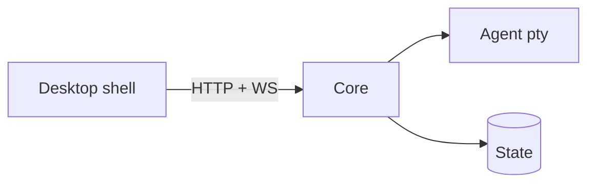

Draw one question per diagram, and say in the caption which question it
answers. A diagram that shows everything shows nothing.

Use Mermaid so the drawing lives in the repository and changes with the
code:

Rules that keep a diagram readable:

- Label every edge with what crosses it: a protocol, a payload, a
  trigger. An unlabelled arrow is a guess.
- Draw the boundaries that matter — process, machine, trust — as
  subgraphs. Most real questions are about what crosses a boundary.
- Keep it under about a dozen nodes. Split by question, not by size.
- Show the direction data actually flows, not the call direction, when
  the two differ.

Update the diagram in the same change that moves the boxes. A stale
diagram costs more than none, because it is believed.
